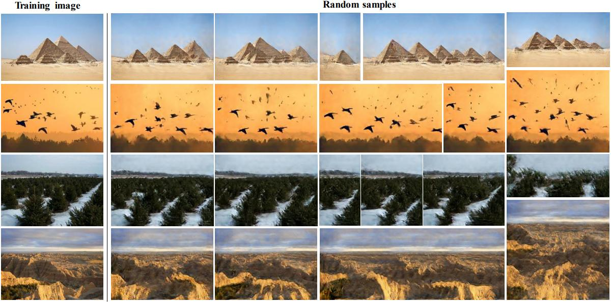

# Fast Learning a Stabilized Generative Model from a Single Image

# Installation
- python 3.6.9
- pytorch 1.1.0
```
pip install -r requirements.txt
```
or you can build ***docker image*** by ***Dockerfile***
```
docker build . -t <docker_image_name>
```
then build ***docker container*** by ***docker image***
```
docker run -t -i --name <docker_container_name> --gpus all --shm-size 120G <docker_image_name> /bin/bash
```


# Random samples from a single image

With our method, we can generate samples of different sizes by inputting different sizes of noise.



## Train

To train a model with the default parameters:

```
python main_train.py --gpu 0 --train_mode generation --input_name Images/Generation/angkorwat.jpg
```

Training one model should take about 10-15 minutes on an NVIDIA GeForce GTX 2080.

## Random samples

To sample more images from a trained model:

```
python evaluate_model.py --gpu 0 --model_dir TrainedModels/.../.../ --num_samples 50
```

The results will be saved in a folder `Evaluation` in the `model_dir`.

## Evaluation

To calculate the SIFID and diversity between real image and their corresponding fake samples, please run:

```
python evaluate_score.py --img_path <image_path> --model_path TrainedModels/.../.../
```

Images should be saved in .jpg format.
